---
Parent:
  - - CS6460
Date: 21:16 12/01/2025
title: Homework 1 - Shell
ShowBreadCrumbs: false
---

This assignment will teach you how to use the Unix system call interface and the shell by implementing a small shell, which we will refer to as the 5460/6450 shell. You will also learn how to use GDB to debug your code.

You can do this assignment on any operating system that supports the Unix API (Linux CADE machines, your laptop that runs Linux or Linux VM, and even MacOS, etc.). **You don\'t need to set up xv6 for this assignment** Submit your programs and the shell through Gradescope (see instructions at the bottom of this page).

**NOTE: YOU CANNOT PUBLICLY RELEASE SOLUTIONS TO THIS HOMEWORK**. It\'s ok to show your work to your future employer as a private Git repo, however any public release is prohibited.

For **Mac / OSX** users. The support of 32 bit applications is depricated in the latest version of your system. So if you already updated your system to macOS Catalina or have updated your XCode then we recommend you to do the homework at the CADE machines.

**NOTE:** We are aware that there are several tutorials on writing shells online. This assignment itself borrows heavily from Stephen Brennan\'s [blog post](https://brennan.io/2015/01/16/write-a-shell-in-c/). We strongly encourage you to do this assignment without referring to the actual code in those implementations. You are welcome to look at broad concepts (which we also try to explain here), but the actual implementation should be your work.

**NOTE:** We recently were made aware of the [GNU readline library](https://tiswww.case.edu/php/chet/readline/rltop.html). Bash (and other shells) rely heavily on it for auto-complete, moving the cursor around when entering input, and even reverse-search. For those interested, this is a really interesting read on the [history of `readline`](https://twobithistory.org/2019/08/22/readline.html). For the purposes of this assignment, using `readline` is not allowed, as it would make several implementation details entirely trivial. We want you to learn by implementing a shell, including it\'s intricacies.

**TIP:** While building this assignment, several parts, like adding support for I/O redirection and pipes might not be immediately obvious, and are quite involved. We encourage you to take a look at xv6\'s shell to get design clues ([sh.c](https://github.com/mit-pdos/xv6-public/blob/master/sh.c)).

Note however, that you cannot take the xv6 implementation and submit it (or any other submissions from previous years). You might pass all the test cases, but you will receive a 0 on this assignment if you don\'t submit what is entirely your work.

We will build shell in the following parts: 1) Reading and parsing a command, 2) Executing programs, 3) Implementing support for I/O redirection, and 4) Implementing support for pipes.

To start, this is a skeleton of a simple UNIX shell.

``` {style="position: relative;"}
#include <stdlib.h>
#include <unistd.h>
#include <stdio.h>
#include <fcntl.h>
#include <string.h>
#include <assert.h>
#include <sys/types.h>
#include <sys/stat.h>
#include <sys/wait.h>
#include <errno.h>

int main(int argc, char **argv)
{
  sh_loop();
  return EXIT_SUCCESS;
}
```

As we will see, the shell is a program that essentially waits for user input, executes commands, and repeats. We will keep our shell simple, by just calling a function `sh_loop`, that loops indefinitely, reading, interpreting and executing commands. Typically a shell does much more (steps related to initialization, configuration, termination, shutdown and so on). If you put the above snippet into a file `sh.c`, you can compile it with a C compiler, such as gcc. On CADE machines you can compile it with the following command:

``` {style="position: relative;"}
$gcc sh.c -o utsh
```

Here gcc will compile your program as `utsh`. (Note that the above file won\'t compile, as we have not definted `sh_loop` yet). In the rest of this part of the assignment you will convert `sh.c` into a shell.

## The basics

The main job of a shell is to execute commands. One way to break this down is:

1.  **Read** commands from the standard input.
2.  **Parse** the command string by separating it into a program string and its argument string.
3.  **Execute** the program, passing to it the appropriate arguments.

The `sh_loop()` function, hence can look something like the following.\

``` {style="position: relative;"}
void sh_loop(void)
{
  char *line;
  char **args;
  int status;

  do {
    printf("utsh$ ");
    line = sh_read_line();
    args = sh_split_line(line);
    status = sh_execute(args);

    free(line);
    free(args);
  } while (status);
}
```

It runs in a loop, and it provides a prompt to the user every time the loop executes:

``` {style="position: relative;"}
utsh$ 
```

Once the user enters a command, it calls `sh_read_line` to read the command, `sh_split_line` to parse it, and finally `sh_execute` to execute the command. It then loops back, trying to do the same thing all over again. Note here that the termination of the loop is dependant on the `status` variable, which you will have to set appropriately when you write the `sh_execute` function.

## Reading a line

We do not want to test you on your skills with reading and parsing lines in C, which can be quite involved if one wants to handle several possible error situations. Hence, we provide you with a template for `sh_loop()` below.

The shell has to read characters from stdin into a buffer to parse it. The thing to note is that you cannot know before hand, how much text a user is going to input as a command, and hence, you cannot know how much buffer to allocate. One strategy is to start with an allocation of small size using `malloc`, and then reallocate if we run out of memory in the buffer. We can use `getchar()` to read character by character from stdin in a `while` loop, until we see a newline character, or an EOF character. In case of the former, return the buffer which has been filled by command characters until this point, after null-terminating the buffer. In case of an EOF it is customary to exit the shell, which we do. Note that an EOF can be sent using `CTRL_D`.

We encourage you to try out writing your `sh_read_line` function using `getchar()` as mentioned above, which is a good learning opportunity. More recently however, the `getline` function was added as a GNU extension to the C library, which makes our work a lot easier.

``` {style="position: relative;"}
char *sh_read_line(void)
{
  char *line = NULL;
  size_t bufsize = 0;  // have getline allocate a buffer for us

  if (getline(&line, &bufsize, stdin) == -1) {
    if (feof(stdin))  // EOF
    {
      fprintf(stderr, "EOF\n");
      exit(EXIT_SUCCESS);
    } else {
      fprintf(stderr, "Value of errno: %d\n", errno);
      exit(EXIT_FAILURE);
    }
  }
  return line;
}
```

We have given an implementation of the parser for you, but make sure you understand what `getline` is doing.

## Parsing the line

Now that we have the line inputted by the user, we need to parse it into a list of arguments. We won\'t be supporting backslash or quoting in our command line arguments. The list of arguments will be simply be separated by whitespace. What this means is a command like `echo "hello world"`, will be parsed into 3 tokens: `echo`, `"hello`, and `world"` (and not into 2 tokens `echo`, and `hello world` as it should be ideally).

That being said, the parser, `sh_split_line`, should split the string into tokens, using whitespace as the delimiter. ` strtok ` comes to our rescue:

``` {style="position: relative;"}
#define SH_TOK_BUFSIZE 64
#define SH_TOK_DELIM " \t\r\n\a"

char **sh_split_line(char *line)
{
  int bufsize = SH_TOK_BUFSIZE;
  int position = 0;
  char **tokens = malloc(bufsize * sizeof(char *));
  char *token, **tokens_backup;

  if (!tokens) {
    fprintf(stderr, "sh: allocation error\n");
    exit(EXIT_FAILURE);
  }

  token = strtok(line, SH_TOK_DELIM);
  while (token != NULL) {
    tokens[position] = token;
    position++;

    if (position >= bufsize) {
      bufsize += SH_TOK_BUFSIZE;
      tokens_backup = tokens;
      tokens = realloc(tokens, bufsize * sizeof(char *));
      if (!tokens) {
        free(tokens_backup);
        fprintf(stderr, "sh: allocation error\n");
        exit(EXIT_FAILURE);
      }
    }

    token = strtok(NULL, SH_TOK_DELIM);
  }
  tokens[position] = NULL;
  return tokens;
}
```

At the start of the function, we begin tokenizing by calling `strtok()` which returns a pointer to the first \"token\". What `strtok()` actually does is return pointers to within the string you give it (we call that pointer `token`), and places a null terminator `\0` at the end of each token. We store each pointer in an array (buffer) of character pointers called `tokens`. Finally, we reallocate the array of pointers if necessary. The process repeats until no token is returned by `strtok()`, at which point we null-terminate the list of tokens.

## Part 0: Debugging the shell program with VSCode

VSCode does not just allow you to develop locally, but you can also SSH to other machines directly from VSCode. You will have all the features - a file explorer on the sidebar, full VSCode Extension support, and the integrated terminal, as well as the VSCode Debugger, which is what this section will guide you to use. 

### On-Campus SSH

If you are on-campus and connected to UConnect, it is very easy to SSH into a CADE Lab machine.

1. Use [NoMachine](https://nx.eng.utah.edu) to check the availability of the CADE machines. You want to use a machine from lab1 or lab2 (they are running Linux), and preferably one with a low number of active users. 
2. Open a Terminal and SSH into the machine you picked just to make sure you are able to connect to it, and your password works. `ssh uXXXXXXX@labY-ZZ.eng.utah.edu` should be enough. What you need to check for is that it does not ask you for 2FA authentication - this happens if you are neither connected to UConnect nor to the Campus VPN. **You don't need to do this step each time, but if your connection through VSCode keeps failing you might want to double check the server's availability using this method.**
3. Open VSCode, and ensure you have the Remote - SSH Extensions installed (open the Extensions tab and search for `ms-vscode-remote.remote-ssh`)
4. `Cmd`+`Shift`+`P` / `Ctrl`+`Shift`+`P` will open the Command Palette.
	1. Type `SSH` and select the `Remote-SSH: Connect to Host` option 
	2. Click on `Add New SSH Host` 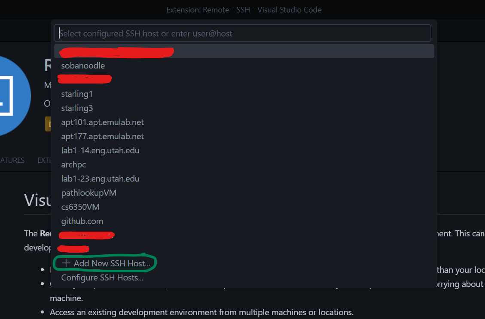
	3. Type out the same SSH command into the text-field that shows up. 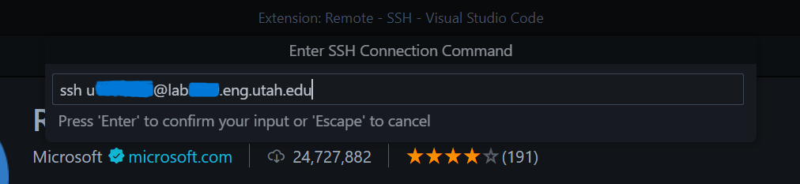
	4. It will ask you to select an SSH Configuration File - select the one in your User Directory - this will save the connection details so next time you don't have to go through all these steps, and it will show up in the list you can see in Step 4.2 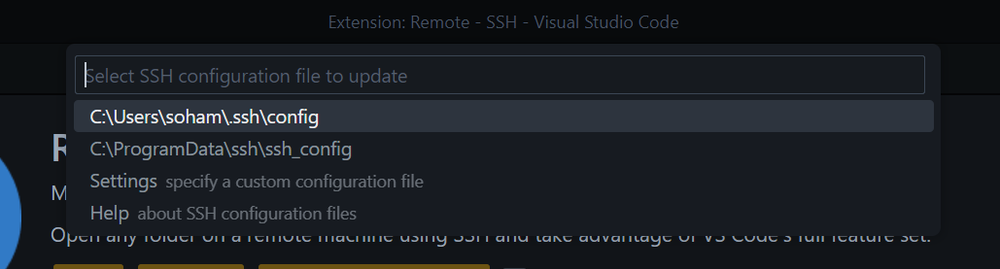
	5. Once it is done, you can connect to your newly saved host by clicking `Connect` in the panel that shows up on the bottom-right. Don't worry if it does not show up, just do `Cmd`+`Shift`+`P` / `Ctrl`+`Shift`+`P` and select `Remote-SSH: Connect to Host` and it should show up on the list (like in Step 4.2) 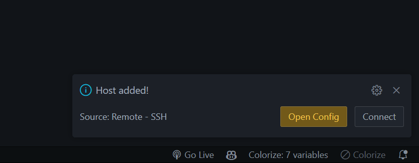
	6. The first time you connect it will ask what platform the remote host is, you must select `Linux` 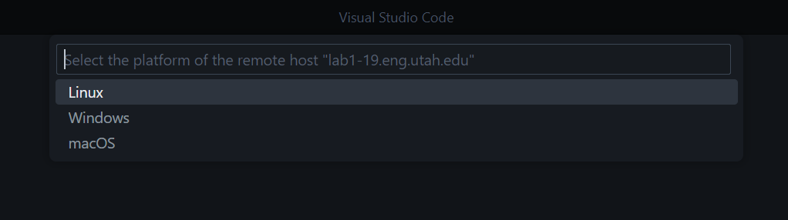
	7. Et voila! Your VSCode is connected to a CADE Lab machine. Within VSCode, you can navigate it the same way you're used to navigating VSCode. Make sure to install any extensions you like to use (your themes should have pre-loaded). Make sure to install the C/C++ Extension Pack (`ms-vscode.cpptools-extension-pack`)
### Off-Campus SSH

CADE allows you to SSH off-campus using the 2FA Authentication, but VSCode has a hard time navigating through that. Instead, you should install and use the **Palo Alto GlobalProtect VPN**. 

1. [University Information Technology Homepage](https://it.utah.edu/network/index.php)
2. Look for this Guide (I could not link to it since it requires a uNID login) 
3. It should redirect you to **Article KB0000538**, and you should be able to download the GlobalProtect Client from (https://vpn.utah.edu)
4. Install the VPN, launch it, authenticate using your uNID and Duo, and you should be able to follow the same steps as the On-Campus instructions to SSH into your CADE Machine. 

### Debugging C with VSCode

VSCode's Debugger for C uses GDB in the backend, but allows you to use VSCode Debugger's rich interface to navigate all the information. You may want to download [sh_t.c](https://users.cs.utah.edu/~aburtsev/5460/hw/hw1-shell/sh_t.c) and change the command you ran to build sh.c to

``` {style="position: relative;"}
$ gcc sh_t.c -o utsh -Wall -g -fno-pic 
```

This will compile your shell program with debugging symbols (`-g` flag), and for simplicity avoid generating position independent code (` -fno-pic` flag).

1. To get started, SSH into a CADE Machine, and open the directory with your assignment files. If you are starting fresh, you should create a new directory and create your code files first.  

2. Click on `Run and Debug` in your Activity Bar (or `Cmd`+`Shift`+`D` / `Ctrl`+`Shift`+`D`) 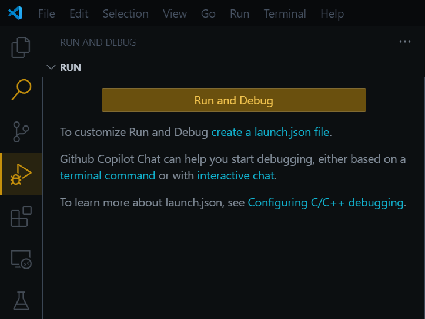
3. Click on `create a launch.json file` - this file tells VSCode which executable to debug, which debugger to use, and how the debugger interacts with your executable. There are two main options: **Attach** (which attaches the debugger to a running process) and **Launch** (which launches a process and attaches directly). We will be using **Launch** for this assignment, but you might want to use **Attach** for future assignments. 
4. This will do two things: first it will create a hidden `.vscode` folder with internal configuration files, and second it will create a `launch.json` file inside that directory. Assuming you installed the C/C++ Extension Pack, VSCode should show you the following options in the `launch.json` editor: 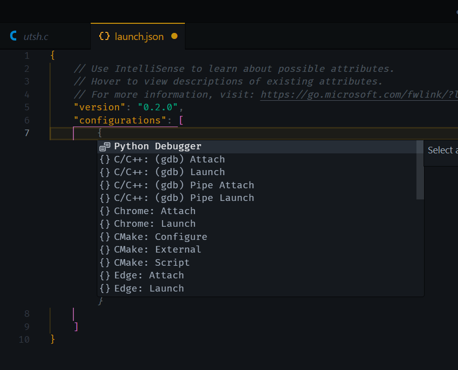
5. We will select the `C/C++: (gdb) Launch` option. It will output a pre-populated JSON object into the file: 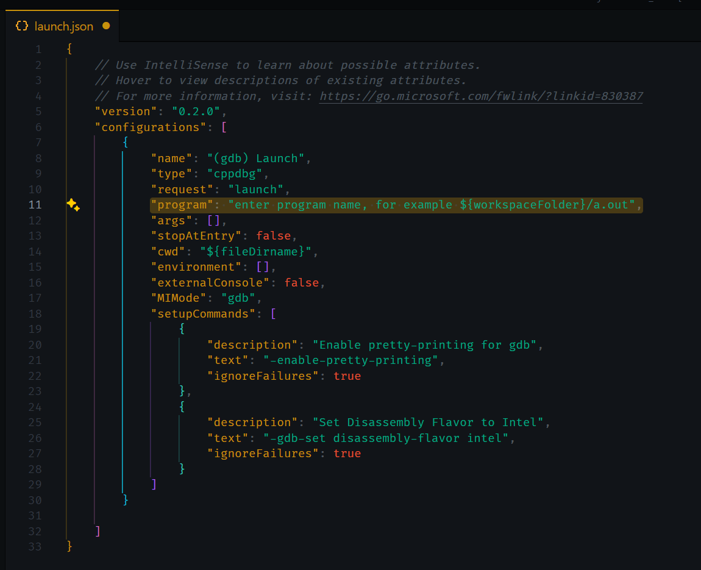
6. The highlighted line is the only one that needs to be modified. Rewrite it to say `"${workspaceFolder}/a.out"` or `"${workspaceFolder}/utsh"`, depending on whether you are passing `-o utsh` as part of your compiler flags (`a.out` is the default output filename if none is provided explicitly). 
7. Save the file, and you should be good to go! The `Run and Debug` panel on the left should have a Play button which you can use to start a debugging session 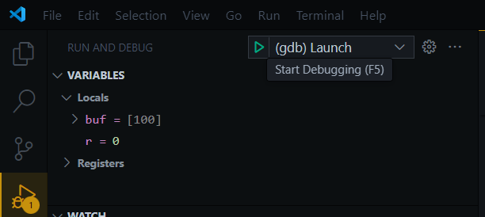
#### Breakpoints and single stepping

Breakpoints are what the name suggests - points in the code where the execution breaks (or pauses), allowing you to inspect the state of the system at that exact point. This includes local and global variables as well as the call stack. 

On VSCode, it is very easy to set a breakpoint. Simply open your code file, scroll down to the line you want to set a breakpoint at, and click the red circle to the left of the line number. 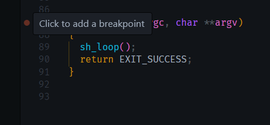
When you run the program using the debugger, the execution will halt when it reaches that line. 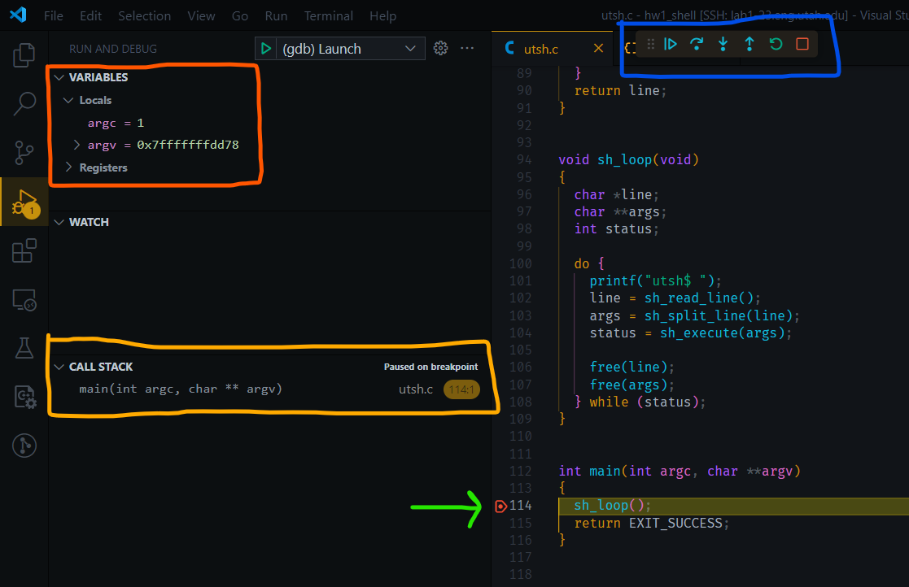
- The red box lists all the local variables and their contents
- The yellow box displays the call stack - since this is only main(), there are no caller functions
- The blue box are fine-grained controls for the execution. From left to right:
	- **Continue** will end the break and continue execution (`c` from regular gdb)
	- **Step Over** will let sh_loop() execute and break at the next line (line 115), it essentially skips an inspection of the function on the highlighted line (`n` from regular gdb)
	- **Step Into** will follow the execution into sh_loop(), breaking at the first line of sh_loop() (`s` from regular gdb)
	- **Step Out** will speed-through the execution of the current function and break back at the caller function. For example, if we had stepped into sh_loop(), stepping out would bring us to line 115. 
	- **Restart** kills the current session and restarts the debugging session
	- **Stop** kills the current debugging session

Try placing a few breakpoints throughout your code to familiarize yourself with these functionalities. Make sure to inspect the state at each breakpoint to get a better idea of what can be monitored.

#### Conditional Breakpoints

While debugging programs it's often useful to see what the program is doing right before it crashes. One way to do this is to step through, one at a time, every statement of the program, until we get to the point of execution where we want to examine the state of the program. This works, but sometimes you may want to just run until you reach a particular section of code based on a condition, and stop execution at that point so you can examine data at that point of execution. 

For instance, in the `sh_loop` function, you might want to examine the state of the program when the `line i` is equal or not equal to `NULL`.

VSCode's Debugger allows you to set conditional breakpoints, just like GDB does. To set a conditional breakpoint to break inside the loop of the `sum` function when the `line i` is equal to `NULL`, we can right click the red circle next to the line and click `Add Conditional Breakpoint` 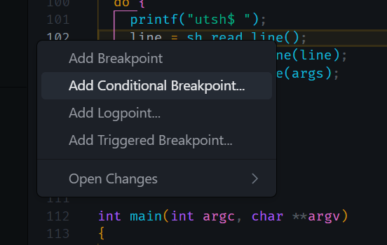
This will prompt you for a condition, and to make the breakpoint trigger only when `line` is equal to `NULL` we type `line != 0`. 

#### Exploring crashes

Now, let's take a look at how you can use GDB to debug your crashing programs. First, let's generate a program that crashes. In your `shell.c`, change line 71 to `tokens[11111111] = token;` and recompile. 

Launch the debugger without any breakpoints, and the program should crash when execution reaches line 71. 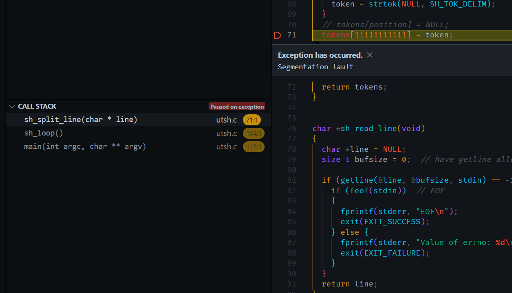
The **Call Stack** on the left will show you the flow of execution. We can see that the exception has occurred on line 71, in the function `sh_split_line`, which was called by `sh_loop` in line 104, which was called by `main` in line 115. 


## Part 1: Executing programs (30 Points)

**NOTE:** For the rest of this assignment, *you* will be doing all the implementation. You are free to modify any functions that we provide, including their signatures. What we provide is a template which we encourage you to use, as we expect it will make things easier for you.

Now, finally we can come to the part where we make our tiny shell do what it was created for: starting to execute programs! By now, our shell should start and offer the user a prompt:

``` {style="position: relative;"}
utsh$
```

In this part of the assignment, you have to extend the shell to allow simple execution of external programs, for instance `ls `:

``` {style="position: relative;"}
utsh$ ls
bar.txt foo.txt utsh sh.c
utsh$
```

The execution of programs, of course, is handled by the `sh_execute` function.

``` {style="position: relative;"}
int sh_execute(char **args)
{
  if (args[0] == NULL) {
    return 1;  // An empty command was entered.
  }
  return sh_launch(args);   // launch
}
```

You should do this by implementing the `sh_launch ` function. Use the UNIX interface that we\'ve discussed in class (the functions to cone processes, i.e., `fork()`, executing new processes, i.e., `exec()`, working with file descriptors i.e., `close(), dup(), open(), wait()`, etc. to implement the various shell features.

Remember to return an appropriate return value from `sh_launch` as the main loop ` sh_loop` depends on it. Feel free to modify how you use the `status` variable in `sh_loop`. Print an error message when `exec` fails.

You might find it useful to look at the manual page for `exec`, for example, type

``` {style="position: relative;"}
$man 3 exec
```

and read about `execv`.

**NOTE:** When you type `ls` your shell may print an error message (unless there is a program named `ls` in your working directory or you are using a version of `exec` that searches `PATH`, i.e., `execlp(), execvp(), or execvpe())`. Now type the following:

``` {style="position: relative;"}
utsh$ /bin/ls
```

This should execute the program `/bin/ls`, which should print out the file names in your working directory. You can stop the utsh shell by inputting `CTRL_D`, which should put you back in your computer\'s shell.

You may want to change the utsh shell to always try `/bin`, if the program doesn\'t exist in the current working directory, so that below you don\'t have to type \"/bin\" for each program, or (which is better) use one of the exec functions that search the `PATH` variable.

Your shell should handle arguments to the called program , i.e. this should work

``` {style="position: relative;"}
utsh$ ls /home
aburtsev
utsh$
```

**TIP:** In GDB, if you want to debug child processes, ` set follow-fork-mode child ` is sometimes useful. This is a good [reference](https://sourceware.org/gdb/onlinedocs/gdb/Forks.html) .

## Part 2: I/O redirection (30 Points)

Now that you can execute commands, let us extend the features our shell provides. Now you have to implement I/O redirection commands so that you can run:

``` {style="position: relative;"}
utsh$ echo "utsh is cool" > x.txt
utsh$ cat < x.txt
utsh is cool
utsh$
```

You should extend ` sh_execute ` to recognize \"`>`\" and \"`<`\"characters. Remember to take a look at xv6\'s shell to get design clues.

You might find the man pages for `open` and `close` useful. Make sure you print an error message if one of the system calls you are using fails.

## Part 3: Pipes (40 Points)

Finally, you have to implement support for pipes so that you can run command pipelines such as:

``` {style="position: relative;"}
utsh$ ls | sort | uniq | wc
     11      11      85
utsh$
```

You have to extend ` sh_execute ` to recognize \"`|`\". You might find the man pages for `pipe`, `fork`, `close`, and `dup` useful.

Test that you can run the above pipeline. The `sort` program may be in the directory `/usr/bin/` and in that case you can type the absolute pathname `/usr/bin/sort` to run sort. (In your computer\'s shell you can type `which sort` to find out which directory in the shell\'s search path has an executable named \"sort\".)

From one of the CADE machines you should be able to run the following command correctly (here a.out is your utsh shell):

``` {style="position: relative;"}
$ a.out < t.sh
```

# Submit your work

Submit your solution through Gradescope [Gradescope CS5460/6450 Operating Systems](https://www.gradescope.com/courses/702170/). Pack your shell, `sh.c` into a zip archive and submit it. Please name the C file `sh.c`. You can resubmit as many times as you wish. If you have any problems with the structure the autograder will tell you. The structure of the zip file should be the following:

``` {style="position: relative;"}
/
  - sh.c
```

## Challenge exercises (total extra 50%, 10% each)

The shell we have built is very simple. It does not support built-in commands, like `cd`, `history`, etc. It does not support providing a list of commands, or running jobs in the background. There is no support for globbing, quoting or backslash escaping, to name a few important features typical in shells.

You can add **any** feature of your choice to your shell. But, you may want to consider the following as a start:

-   Support for `cd`.\
    It is a useful exercise to figure out how why `cd` doesn\'t work when provided as a command line argument to our shell, and make it work.

    ``` {style="position: relative;"}
    utsh$ pwd
    /home/harishankarv/cs5460/hw2/
    utsh$ cd ../hw1
    utsh$ pwd
    /home/harishankarv/cs5460/hw1/
    ```

-   Support for command history.\
    ` history ` is another built-in shell command which displays a history of the commands entered in the current session of shell invocation. Note that using the GNU `readline` library is not allowed.

    ``` {style="position: relative;"}
    utsh$ perl
    utsh$ dos2unix
    utsh$ history
       1  perl
       2  dos2unix
       3  history
    ```

-   Support for globbing.\
    Shells typically support globbing, which looks for the `*` and `?`, etc. pattern matchers in the command and perform a pathname expansion and replace the glob with matching filenames when it invokes the program.

    ``` {style="position: relative;"}
     cp *.jpg /some/other/location 
    ```

    will copy all files with .jpg in the current directory to `some/other/location`

-   Support for a **list** of commands separated by a `;`.\
    You can usually run a list of commands in one line in most of the popular shells around, by separating the commands by a `; `:\

    ``` {style="position: relative;"}
      cmd1 ; cmd2 ; cmd3
    ```

-   Support for runing commands in the background using `&`.\
    One can typically ask the shell to run a command in the \"background\" by appending a `&` at the end. The command is then run as a job, asynchronously.

    ``` {style="position: relative;"}
    cmd arg1 arg2 &
    ```


