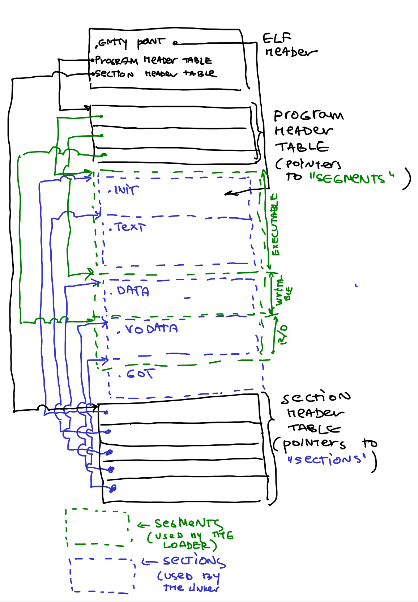
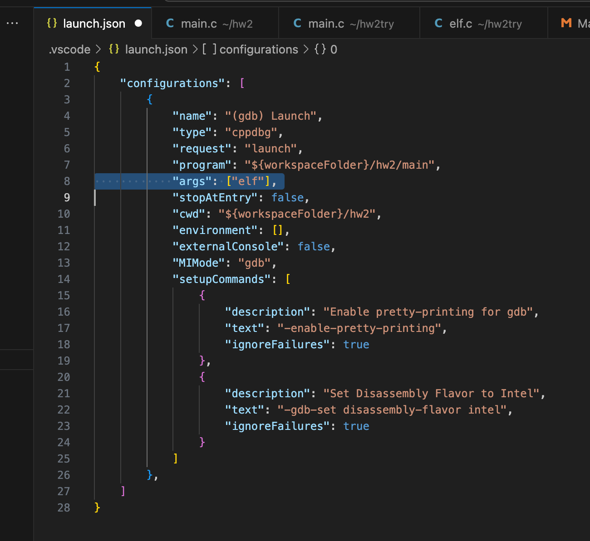
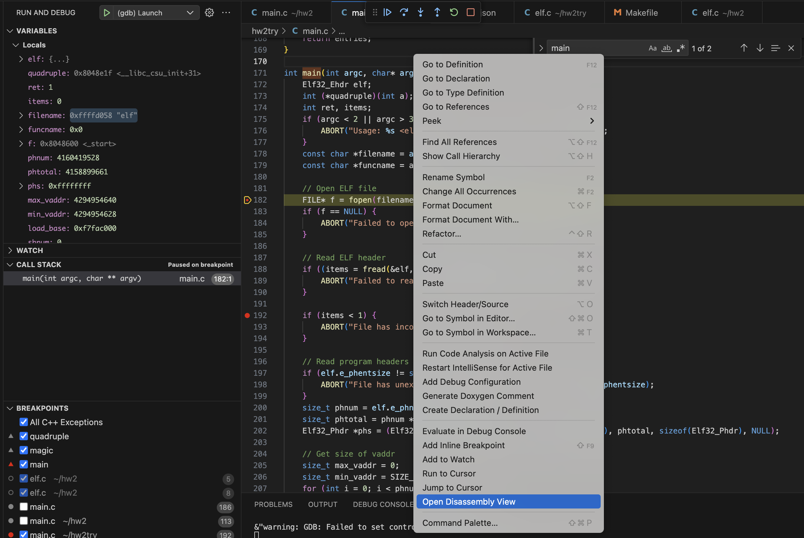
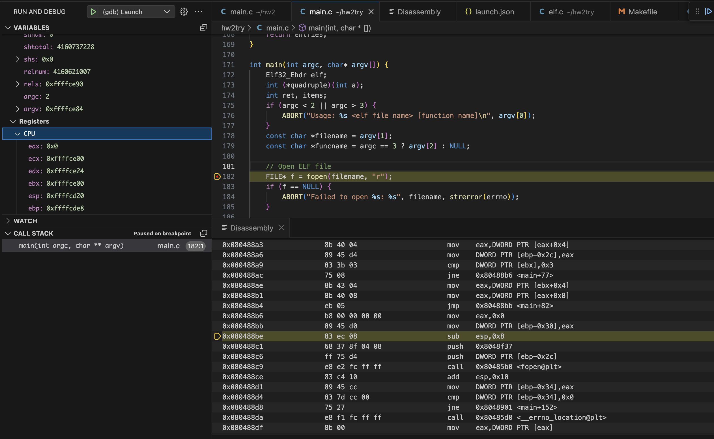
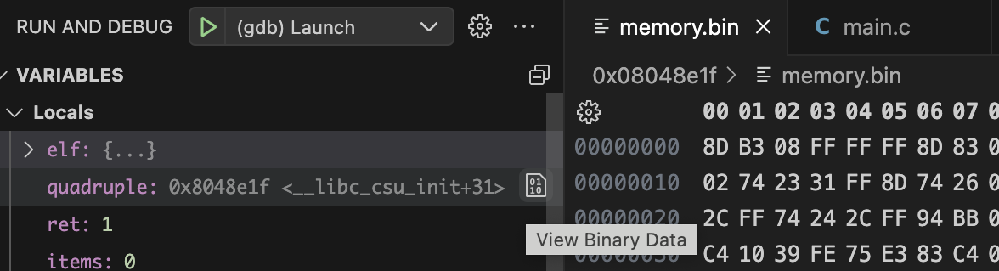

 CS5460/6450 Operating Systems   


[Home](../../index.html) 

Homework 2: ELF files
=====================

This assignment will make you more familiar with organisation of ELF files. Technically, you can do this assignment on any operating system that supports the Unix API (Linux CADE machines, your laptop that runs Linux or Linux VM, and even MacOS, etc.). **You don't need to set up xv6 for this assignment** Submit your programs and the shell through Gradescope (see instructions at the bottom of this page).

**NOTE: YOU CANNOT PUBLICLY RELEASE SOLUTIONS TO THIS HOMEWORK**. It's ok to show your work to your future employer as a private Git repo, however any public release is prohibited. For **Mac / OSX** users. The support of 32 bit applications is deprecated in the latest version of your system. So if you already updated your system to MacOS Catalina or have updated your XCode then we recommend you to do the homework at the CADE machines.

Part 1: Take a look at ELF files
--------------------------------

At a high level this homework first shows you how to implement a simple ELF loader [\>main.c](./main.c) file) (we use it to load a simple ELF object file compiled from [elf.c](./elf.c)), and then asks you to relocate it to run at the address at which you load it. However, before starting on this lets make ourselves familiar with ELF files.

We provide a simple [Makefile](Makefile) that compiles elf and main as ELF executables. Look over the makefile and then compile both files by running:

``` {style="position: relative;"}
make
```

Lets take a look at the ELF files we compiled. We will use the readelf tool

``` {style="position: relative;"}
$ readelf -a elf
```
ELF is the file format used for object files (`.o`'s), binaries, shared libraries and core dumps in Linux.

It's actually pretty simple and well thought-out.

ELF has the same layout for all architectures, however endianness and word size can differ; relocation types, symbol types and the like may have platform-specific values, and of course the contained code is arch specific.

The ELF files are used by two tools: 1) linker and 2) loader. A linker combines multiple ELF files into an executable or a library and a loader loads the executable ELF file in the memory of the process. On real operating systems loading may require relocation (e.g., if the file is dynamically linked it has to be linked again with all the shared libraries it depends on). In this homework we will not do any relocation (it's too complicated), we'll simply load an ELF file in memory and run it.

Linker and loader need two different views of the ELF file, i.e., they access it differently---the linker needs to know where the DATA, TEXT, BSS, and other sections are to merge them with sections from other libraries. If relocation is required the linker needs to know where the symbol tables and relocation information is.

The loader, however, does not need any of these details. It simply needs to know which parts of the ELF file are code (executable), which are data and read-only data, and where to put the BSS in the memory of a process.

Hence the ELF file provides two separate views on the data inside the ELF file: 1) a more detailed view for the linker, and 2) a bit more high-level view for the loader. To provide these view each ELF file contains two arrays: Section Header Table (for the linker), and Program Header Table (for the loader). Both tables are simply arrays of entries that contain information about each part of the ELF file (e.g., where the sections for the linker and section for the loader are inside the ELF file).

Here is a simple figure of a typical ELF file that starts with the ELF header. The header contains pointers to the locations of Section Header Table and Program Header Table within the ELF file. Then each tables have entries that point to the starting locations of individual sections and segments.



Lets take a look at both arrays.

Linking view: Section Header Table (SHT)
----------------------------------------

The Section Header Table is an array in which every entry contains a pointer to one of the sections of the ELF file. **It's a bit annoying but the parts of the ELF file used by the linker are called "sections", and the parts used by the loader are called "segments"** (my guess is that different CPU segments were configured in the past for each part of the program loaded in memory, hence the name "segments", for example, an executable CPU segment was created for the executable parts of the ELF file (i.e., one segment that contained all executable sections like .text, .init, etc.).

Also don't get confused: sections and segments overlap. I.e., typically multiple sections (.text, .init) are all contained in one executable segment. Confusing, huh? It will become clear soon.

Lets take a look at what inside the ELF file. Run this command

``` {style="position: relative;"}

readelf -a elf

```

If you scroll down to the **Section headers** you will see all "sections" of the ELF file that the linker can use:

 ``` {style="position: relative;"}

Section Headers:
  [Nr] Name              Type            Addr     Off    Size   ES Flg Lk Inf Al
  [ 0]                   NULL            00000000 000000 000000 00      0   0  0
  [ 1] .note.gnu.build-i NOTE            080480b4 0000b4 000024 00   A  0   0  4
  [ 2] .gnu.hash         GNU_HASH        080480d8 0000d8 000018 04   A  3   0  4
  [ 3] .dynsym           DYNSYM          080480f0 0000f0 000010 10   A  4   1  4
  [ 4] .dynstr           STRTAB          08048100 000100 000001 00   A  0   0  1
  [ 5] .rel.text         REL             08048104 000104 000020 08  AI  3   6  4
  [ 6] .text             PROGBITS        08048124 000124 00002d 00 WAX  0   0  1
  [ 7] .eh_frame         PROGBITS        08048154 000154 000000 00   A  0   0  4
  [ 8] .dynamic          DYNAMIC         08048154 000154 000080 08  WA  4   0  4
  [ 9] .data             PROGBITS        080481d4 0001d4 000008 00  WA  0   0  4
  [10] .bss              NOBITS          080481dc 0001dc 000004 00  WA  0   0  4
  [11] .comment          PROGBITS        00000000 0001dc 00002d 01  MS  0   0  1
  [12] .symtab           SYMTAB          00000000 00020c 000180 10     13  16  4
  [13] .strtab           STRTAB          00000000 00038c 000050 00      0   0  1
  [14] .shstrtab         STRTAB          00000000 0003dc 000079 00      0   0  1
Key to Flags:
  W (write), A (alloc), X (execute), M (merge), S (strings), I (info),
  L (link order), O (extra OS processing required), G (group), T (TLS),
  C (compressed), x (unknown), o (OS specific), E (exclude),
  p (processor specific)
```

The elf.c is a simple program, but it still has .text, `.data`, `.bss`, and `.rel.text` (relocation) sections and a bunch of sections that contain symbol information and a ton of other stuff.

Since `elf.c` has two initialized and one uninitialized global variables the ELF has data section of 8 bytes and the BSS section of 4 bytes (each variable is a 4 byte integer).

The program is linked elf.c to run at address 0x08048000 which is the default program linking address on UNIX systems (the reasons are choosing this address are historical and not entirely clear but it is what it is (see this short email for some quesses [Reorganizing the address space](https://lwn.net/Articles/91985/)

The symbol table contains the following symbols

``` {style="position: relative;"}

Symbol table '.symtab' contains 24 entries:
   Num:    Value  Size Type    Bind   Vis      Ndx Name
     0: 00000000     0 NOTYPE  LOCAL  DEFAULT  UND
     1: 080480b4     0 SECTION LOCAL  DEFAULT    1
     2: 080480d8     0 SECTION LOCAL  DEFAULT    2
     3: 080480f0     0 SECTION LOCAL  DEFAULT    3
     4: 08048100     0 SECTION LOCAL  DEFAULT    4
     5: 08048104     0 SECTION LOCAL  DEFAULT    5
     6: 08048124     0 SECTION LOCAL  DEFAULT    6
     7: 08048154     0 SECTION LOCAL  DEFAULT    7
     8: 08048154     0 SECTION LOCAL  DEFAULT    8
     9: 080481d4     0 SECTION LOCAL  DEFAULT    9
    10: 080481dc     0 SECTION LOCAL  DEFAULT   10
    11: 00000000     0 SECTION LOCAL  DEFAULT   11
    12: 00000000     0 FILE    LOCAL  DEFAULT  ABS elf.c
    13: 00000000     0 FILE    LOCAL  DEFAULT  ABS
    14: 08048154     0 OBJECT  LOCAL  DEFAULT    8 _DYNAMIC
    15: 080481d4     0 OBJECT  LOCAL  DEFAULT    9 _GLOBAL_OFFSET_TABLE_
    16: 080481d4     4 OBJECT  GLOBAL DEFAULT    9 b
    17: 08048124    32 FUNC    GLOBAL DEFAULT    6 quadruple
    18: 080481d8     4 OBJECT  GLOBAL DEFAULT    9 c
    19: 080481dc     0 NOTYPE  GLOBAL DEFAULT   10 __bss_start
    20: 080481dc     4 OBJECT  GLOBAL DEFAULT   10 d
    21: 08048144    13 FUNC    GLOBAL DEFAULT    6 magic
    22: 080481dc     0 NOTYPE  GLOBAL DEFAULT    9 _edata
    23: 080481e0     0 NOTYPE  GLOBAL DEFAULT   10 _end
```

I.e., it contains names of the two functions quadruple and magic, three global variables b, c, and d. Other symbols like \_\_bss\_start, \_edata, and \_end are added by the linker to mark the start and end of the BSS, TEXT, and DATA sections.

Execution view: Program Header Table (PHT)
------------------------------------------

The Program Header Table contains information for the kernel on how to start the program. The `LOAD` directives determinate what parts of the ELF file get mapped into program memory.

In our elf example the program header defines four segments, but only two of them should be loaded by the operating system in memory to run.

``` {style="position: relative;"}

Program Headers:
  Type           Offset   VirtAddr   PhysAddr   FileSiz MemSiz  Flg Align
  LOAD           0x0000b4 0x080480b4 0x080480b4 0x00128 0x0012c RWE 0x4
  DYNAMIC        0x000154 0x08048154 0x08048154 0x00080 0x00080 RW  0x4
  NOTE           0x0000b4 0x080480b4 0x080480b4 0x00024 0x00024 R   0x4
  GNU_STACK      0x000000 0x00000000 0x00000000 0x00000 0x00000 RW  0x10
```


The only loadable section is linked to be loaded at address 0x080480b4. We can also look at the mappings of sections to segments (we will discuss what sections are below):

``` {style="position: relative;"}
 Section to Segment mapping:
  Segment Sections...
   00     .note.gnu.build-id .gnu.hash .dynsym .dynstr .rel.text .text .eh_frame .dynamic .data .bss
   01     .dynamic
   02     .note.gnu.build-id
   03
```


In other works, inside the first loadable segment the linker placed the following sections: .note.gnu.build-id, .gnu.hash, .dynsym, .dynstr, .rel.text, .text, .eh\_frame, .dynamic, .data, and .bss. We can inspect the elf binary with the objdump tool to see what is inside the `.text` section:


``` {style="position: relative;"}

$ objdump -d -M intel elf

elf:     file format elf32-i386


Disassembly of section .text:

08048124 :
 8048124:       55                      push   ebp
 8048125:       89 e5                   mov    ebp,esp
 8048127:       a1 d8 81 04 08          mov    eax,ds:0x80481d8
 804812c:       0f af 45 08             imul   eax,DWORD PTR [ebp+0x8]
 8048130:       89 c2                   mov    edx,eax
 8048132:       8b 0d d4 81 04 08       mov    ecx,DWORD PTR ds:0x80481d4
 8048138:       a1 dc 81 04 08          mov    eax,ds:0x80481dc
 804813d:       0f af c1                imul   eax,ecx
 8048140:       01 d0                   add    eax,edx
 8048142:       5d                      pop    ebp
 8048143:       c3                      ret

08048144 :
 8048144:       55                      push   ebp
 8048145:       89 e5                   mov    ebp,esp
 8048147:       a1 d4 81 04 08          mov    eax,ds:0x80481d4
 804814c:       6b c0 0e                imul   eax,eax,0xe
 804814f:       5d                      pop    ebp
 8048150:       c3                      ret
```

Well, no surprises: it's the code of the two functions we defined in `elf.c`.

Putting it all together: the ELF header
---------------------------------------

Neither the SHT nor the PHT have fixed positions, they can be located anywhere in an ELF file. To find them the ELF header is used, which is located at the very start of the file.

The first bytes contain the elf magic `"\x7fELF"`, followed by the class ID (32 or 64 bit ELF file), the data format ID (little endian/big endian), the machine type, etc.

At the end of the ELF header are then pointers to the SHT and PHT. Specifically, the Section Header Table which is used by the linker starts at byte 256 in the ELF file, and the Program Header Table starts at byte 52 (right after the ELF header)

``` {style="position: relative;"}
ELF Header:
  Magic:   7f 45 4c 46 01 01 01 00 00 00 00 00 00 00 00 00
  Class:                             ELF32
  Data:                              2's complement, little endian
  Version:                           1 (current)
  OS/ABI:                            UNIX - System V
  ABI Version:                       0
  Type:                              EXEC (Executable file)
  Machine:                           Intel 80386
  Version:                           0x1
  Entry point address:               0x8048124
  Start of program headers:          52 (bytes into file)
  Start of section headers:          1112 (bytes into file)
  Flags:                             0x0
  Size of this header:               52 (bytes)
  Size of program headers:           32 (bytes)
  Number of program headers:         4
  Size of section headers:           40 (bytes)
  Number of section headers:         15
  Section header string table index: 14
```

The entry point of this file is at address 0x8048124. This is exactly what we told the linker to do --- make the function `quadruple` the entry point ( this is done with the following directive to the linker from the Makefile `-e quadruple`.

You might ask a question: why are we making the `quadruple` function to be the entry point? Otherwise, it's not `main`, and really nothing is special about this function. The reason is that it gives us the way to know where quadruple is in the text section so we can invoke it after loading the file. Without making it an entry point we would have to read the symbol table which is doable but would take some additional time (we ask you to do this for an extra credit).

Program loading in the kernel
-----------------------------

The execution of a program starts inside the kernel, in the exec("/bin/wc",...) system call takes a path to the executable file. The kernel reads the ELF header and the program header table (PHT), followed by lots of sanity checks.

The kernel then loads the parts specified in the `LOAD` directives in the PHT into memory. After that the control can be transferred to the entry point of the program.

Example: load an ELF file
=========================

While ELF might look a bit intimidating, in practice the loading algorithm is rather simple:

1.  Read the ELF header (This [Wiki](https://en.wikipedia.org/wiki/Executable_and_Linkable_Format) page should help).
2.  One of the ELF header fields tells you the offset of the program header table inside the file.
3.  Read each entry of the program header table (i.e., read each program header)
4.  Each program header has an offset and size of a specific segment inside the ELF file (e.g., a executable code). You have to read it from the file and load it in memory.
5.  When done with all segments, jump to the entry point of the program. (Note since we don't control layout of the address space at the moment, we load the segments at some random place in memory (the place that is allocated for us by the mmap() function). Obviously the address of the entry point should be an offset within that random area.

The main.c [main.c](./main.c) file implements the above. Take a look at this file.

There is a couple of interesting things going on in this file. First we do a loop through all loadable segments of the file and find the min and max virtual addresses at which the sections can be loaded. Segments can be out-of-order with respect to their virtual addresses and we want to know the range of the addresses that will be used in the end.

``` {style="position: relative;"}

    size_t min_vaddr = SIZE_MAX;
     for (int i = 0; i < phnum; ++i) {
         if (phs[i].p_type != PT_LOAD) {
             continue;
         }
         if (phs[i].p_vaddr > max_vaddr) {
             max_vaddr = phs[i].p_vaddr;
         }
         if (phs[i].p_vaddr < min_vaddr) {
             min_vaddr = phs[i].p_vaddr;
         }
     }
```
To load the segment in memory, we use mmap to get an executable memory from the OS. You can man mmap to read more.

``` {style="position: relative;"}

// Allocate memory for object
void* load_base = mmap(NULL, page_align(max_vaddr - min_vaddr), PROT_READ | PROT_WRITE | PROT_EXEC,
          MAP_ANONYMOUS | MAP_PRIVATE, 0, 0);
```
Now we iterate through all segments in the program header and look for the loadable ones.

``` {style="position: relative;"}

   // Load segments one by one
     for (int i = 0; i < phnum; i++) {
         Elf32_Phdr *ph = phs + i;
         if (ph->p_type != PT_LOAD) {
             continue;
         }

         size_t vaddr = ph->p_vaddr;
         size_t memsz = ph->p_memsz;
         size_t filesz = ph->p_filesz;
         size_t offset = ph->p_offset;

         void *segment_addr = (void*)((uint8_t*)load_base + vaddr - min_vaddr);

         LOG("Segment %#10x -> %#10p (memsz=0x%x, filesz=0x%x, offset=0x%x)\n", vaddr, segment_addr, memsz, filesz, offset);

         // Alternatively, mmap the file directly!
         fseek(f, offset, SEEK_SET);
         if ((items = fread(segment_addr, filesz, 1, f)) < 0) {
             ABORT("Failed to read segment %d: %s\n", i, strerror(errno));
         }
         if (items < 1) {
             ABORT("Segment %d is incomplete\n", i);
         }

         if (filesz < memsz) {
             // Sometimes filesz can be smaller than memsz, and the remaining
             // portion must be zero-initialized (e.g., .bss).
             void *zero_base = (void*)((uint8_t*)segment_addr + filesz);
             size_t zero_len = memsz - filesz;
             memset(zero_base, 0, zero_len);
         }
     }
```
Now we loaded the text section in memory, so we can take an entry point, assign it to the `quadruple` pointer, and call it.

``` {style="position: relative;"}

 if (elf.e_entry) {
         quadruple = (int (*)(int))((uint8_t*)load_base + elf.e_entry - min_vaddr);
     }


     if (func) {
         ret = quadruple(4);
         printf("ret = %d\n", ret);
     }
```
If we run this program it can either crash or return an incorrect result. Our first goal is to understand why.

Part 1: Explain the crash
=========================

`./main elf` crashed. The first part of the homework asks you to explain the crash. Specifically, you should start the program using Visual Studio debugger as we did for Homework 1.

Pass "elf" as input to "args" in the launch.json file as shown in the image below. Update the "program" and "cwd" fields to the respective directory where you have main.c and other files to execute.




Refer to HW1 for how to set a breakpoint on main and start the program using VS debugger. 

Once debugging has started, right-click anywhere in the file and select "Open Disassembly View" as shown in the image below to view the assembly code and source code side by side.





Register information can also be viewed under the variables section on the top left of the window as shown in the above image.

Clicking the small icon on any of the variables will display the binary data (aka "memory") as shown in the image below.



To explain the crash (or incorrect execution) you will need to understand what the code is doing at the level of the assemly code when you invoke the `quadruple` function. Specifically, you should explain which instruction causes the crash and why. Or why the computed value is incorrect. You will submit your explanation as a text file on gradescope.

Part 2: Relocation
==================

Now we're finally ready to start the second part of the assignment: relocating the loaded elf. Specifically, our goal is to learn how to relocate a binary. In the step above we loaded the binary in memory, but it crashes as it was linked to run at an address which is different from the one we loaded it at. Below we will relocate `elf` to run correctly by patching all references to the global variables that need to be relocated.

To preform the relocation, we need to access the relocation table (a table inside the ELF file that contains all information for how to do the relocation).

To access the relocation table, we first read the section header table.
``` {style="position: relative;"}

    // Read section headers
     if (elf.e_shentsize != sizeof(Elf32_Shdr)) {
         ABORT("File has unexpected section header size: %d\n", elf.e_shentsize);
     }
     size_t shnum   elf.e_shnum;
     size_t shtotal = shnum * elf.e_shentsize;
     Elf32_Shdr *shs = (Elf32_Shdr*)load_multiple(f, elf.e_shoff, shtotal, sizeof(Elf32_Shdr), NULL);

     size_t relnum;
     Elf32_Rel *rels = NULL;


     for (int i = 0; i < elf.e_shnum; i++) {
         Elf32_Shdr *sh = shs + i;

         switch (sh->sh_type) {
             case SHT_REL: {
                 if (rels) {
                     ABORT("Loading multiple relocation sections isn't supported\n");
                 }
                 rels = (Elf32_Rel*)load_multiple(f, sh->sh_shoff, sh->sh_size, sizeof(Elf32_Rel), &relnum);
                 LOG("Loaded relocation table\n");
                 break;
             }

         }
     }
     free(shs);
```

The section table contains a number of entries that contain various information used by the linker (as we discussed above). Specifically, each entry has the following C type definition:

``` {style="position: relative;"}
 
typedef struct {
	Elf32_Word	sh_name;
	Elf32_Word	sh_type;
	Elf32_Word	sh_flags;
	Elf32_Addr	sh_addr;
	Elf32_Off	sh_offset;
	Elf32_Word	sh_size;
	Elf32_Word	sh_link;
	Elf32_Word	sh_info;
	Elf32_Word	sh_addralign;
	Elf32_Word	sh_entsize;
} Elf32_Shdr;
```
The `sh_type` defines the type of the entry. The following types are defined by the ELF standard (we only list a subset of types we need in this homework, see ELF standard for a complete list):

``` {style="position: relative;"}

// Section Header Types (sh_type)
#define SHT_SYMTAB  2 // Symbol table
#define SHT_STRTAB  3 // String table
#define SHT_RELA    4 // Relocation entries with addends
#define SHT_REL     9 // Relocation entries without addends
```

Section attribute flags are:
``` {style="position: relative;"}

#define SHF_WRITE 0x01 // Writable section
#define	SHF_ALLOC 0x02 // Exists in memory

```

To relocate a file we will have to iterate through all section header entries of our ELF file and pick the one that has the `SHT_REL` type (there is another relocation type `SHT_RELA` but for simplicity we don't care about it in this homework).

Relocation entires in the table are continuous and the number of entries in a given table can be found by dividing the size of the table (given by `sh_size` in the section header) by the size of each entry (given by `sh_entsize`).

In practice, each relocation table is specific to a single section, so a single file may have multiple relocation tables (but all entries within a given table will be the same relocation structure type). In our case we will only deal with one relocation table. And abort the code if we see another one:

``` {style="position: relative;"}

if (rels) {
    ABORT("Loading multiple relocation sections isn't supported\\n");
}
```
Each relocation entry has the following type:

``` {style="position: relative;"}

typedef struct {
	Elf32_Addr		r_offset;
	Elf32_Word		r_info;
} Elf32_Rel;
```

The value stored in `r_info`, as the upper byte designates the entry in the symbol table to which the relocation applies, whereas the lower byte stores the type of relocation that should be applied.

``` {style="position: relative;"}

#define ELF32_R_TYPE(val) ((val) & 0xff)
#define ELF32_R_SYM(val)  ((val) >> 8)
```

We use the following macros to access type and symbol table entry.

The value in `r_offset` gives the relative position of the symbol that is being relocated, within its section.

The real messy part about relocation is that there can be different kinds of relocation actions. You can find the complete list defined by the ELF standard here: [32-bit x86: Relocation Types](https://docs.oracle.com/cd/E19120-01/open.solaris/819-0690/chapter6-26/index.html). We define just two types below:

``` {style="position: relative;"}
#define R_386_32          1               // Direct 32 bit
#define R_386_RELATIVE    8               // Adjust by program base

```

Many types of relocation require accessing the relocation value stored in the symbol table. For example, the `R_386_32` relocation type requires you to read the value (addend) from the relocation address specified by the `r_offset` field of the relocation entry and add it to the value (symbol) stored in the symbol table that corresponds to the symbol being relocated (i.e., pointed by the `ELF32_R_SYM(r_info)`.

In our example, the `elf` is compiled to require the `R_386_RELATIVE` relocation. Specifically, this relocation type just asks you to read the value (addend) from the relocation address specified by the `r_offset` field of the relocation entry and add it to the base address at which the ELF is loaded. This is simple -- no need to access the symbol table, just read the value that is already there, add the base address and write it back.

Just to illustrate it with an example of relocating the access to `b` in the `magic` function:
``` {style="position: relative;"}


08048144 :
 8048144:       55                      push   ebp
 8048145:       89 e5                   mov    ebp,esp
 8048147:       a1 d4 81 04 08          mov    eax,ds:0x80481d4
 804814c:       6b c0 0e                imul   eax,eax,0xe
 804814f:       5d                      pop    ebp
 8048150:       c3                      ret
```

Right now `b` is in the data section at address `0x80481d4`.

The relocation table contains the following entries

``` {style="position: relative;"}

$ readelf -r elf

Relocation section '.rel.text' at offset 0x104 contains 4 entries:
 Offset     Info    Type            Sym.Value  Sym. Name
08048128  00000008 R_386_RELATIVE
08048134  00000008 R_386_RELATIVE
08048139  00000008 R_386_RELATIVE
08048148  00000008 R_386_RELATIVE
```

For example the last entry tells us that `magic` tries to access `b` at address `0x08048148` which is exactly where the `mov` instruction tries to load `b`:
``` {style="position: relative;"}

8048147:       a1 d4 81 04 08          mov    eax,ds:0x80481d4
```

The code was supposed to be loaded at address 0x080480b4 but since we loaded it at address we've got from `mmap()` (i.e., the `load_base` in our code) we will relocate by (`load_base - min_vaddr`). Also, note that the offsets are in the virtual address space of the program, but since we loaded the segments starting from `load_base` you have to compute the correct offsets making sure they point into the loaded code in memory.

Ready to relocate
-----------------

For our relocatable ELF file to run correctly we need to process all relocation entries present in the file. At a high level our algorithm is the following:

1.  Read the elf header (similar to how we do this to read the program header).
2.  Read the section header table.
3.  Iterate over all section headers finding the ones that has type `SHT_REL` (i.e., the relocation table).
4.  Once found you iterate through all entries in the relocation table (remember it will have `sh_size/sh_entsize` entries) and they will be of type `Elf32_Rel`
5.  For each entry perform relocation

You have to fill in the code in this section of the [main.c](main.c) file:

``` {style="position: relative;"}
    // Read section headers
    if (elf.e_shentsize != sizeof(Elf32_Shdr)) {
        ABORT("File has unexpected section header size: %d\n", elf.e_shentsize);
    }
    size_t shnum   elf.e_shnum;
    size_t shtotal = shnum * elf.e_shentsize;
    Elf32_Shdr *shs = (Elf32_Shdr*)load_multiple(f, elf.e_shoff, shtotal, sizeof(Elf32_Shdr), NULL);

    size_t relnum;
    Elf32_Rel *rels = NULL;


    for (int i = 0; i < elf.e_shnum; i++) {
        Elf32_Shdr *sh = shs + i;

        switch (sh->sh_type) {
            case SHT_REL: {
                if (rels) {
                    ABORT("Loading multiple relocation sections isn't supported\n");
                }
                rels = (Elf32_Rel*)load_multiple(f, sh->sh_shoff, sh->sh_size, sizeof(Elf32_Rel), &relnum);
                LOG("Loaded relocation table\n");
                break;
            }

        }
    }
    free(shs);

    if (rels) {
        for (int j = 0; j < relnum; ++j) {
            Elf32_Rel *rel = rels + j;

            uint8_t r_type = ELF32_R_TYPE(rel->r_info);

            // YOUR CODE HERE

        }

        free(rels);
    }
    fclose(f);
```
Extra credit (20)
-----------------

For the extra credit, we ask you to implement support for reading the symbol table entries and calling them. In our example, your code should call the `magic` function instead of the default entry point if invoked with the `magic` argument like this:

``` {style="position: relative;"}

    ./main elf magic
```
Submit your work
----------------
Submit your solution through Gradescope [Gradescope CS5460/6450 Operating Systems](https://www.gradescope.com/courses/947893). Please zip all of your files (main.c, Makefile) and submit them. The structure of the zip file should be the following:
``` {style="position: relative;"}

  - Makefile
  - main.c
  - explain.txt
```


Updated: February, 2025